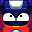

<h1>Mugshots</h1>

Usually, Mega Man Team epilogues have their dialog accompanied with a full sized sprite to enhance the scene. But in this team, every epilogue has its dialog accompanied by mugshots instead. Usually generic NPCs do not have mugshots so they are left with just text.

Since an epilogue is written in script format. Dialog would be written like this:

`Magma: Farts...`

When the sites reads the dialog, it would automatically formats the name and display it with the mugshot and then it bolds and completes the name (notice how you don't need to type "Man" in "Magma Man"):

Magma Man: Farts...

<h1>How to Use Expressions</h1>

With Mugshots being used in epilogues, they are often done with variations of emotions to suit the current dialog. This is done to spice up the epilogue and prevent repetition (a problem that pleagued the team scene eps) and makes each scene stand out better.

The process to use expressions for a mugshot is actually very simple.  Note how just typing "Magma" would only display the Neutral expression of the mugshot. To give him a different expression, you'd have to type the name of the expression right next to his name (no spaces). For example, if you want him to use his Giddy expression, you would have to type like this:

<code>MagmaGiddy: Farts...</code>

With the name of the expression is added right beside the character's name, it'll autmoatically use the variation of the mugshot based on the expression you've typed. So in this case, it'd be displayed as:

Magma Man: Farts...

<h5>(Note: The example shown is an expression exclusive to Magma Man)</h5>

Basic expressions - Outside of a few instances, everyone shares these type of expressions.

|          |Neutral| Happy |Annoyed| Angry |Shocked|  Sad  |Damaged|
|-------|:---:|:---:|:---:|:---:|:---:|:---:|:---:|:---:|
| Magma    |Magma:|MagmaHappy:|MagmaAnnoyed:|MagmaAngry:|MagmaShocked:|N/A|MagmaDamaged:|
| Hornet   |Hornet:|N/A|HornetAnnoyed:|HornetAngry:|HornetShocked:|N/A|HornetDamaged:|
| Concrete |Concrete:|ConcreteHappy:|ConcreteAnnoyed:|ConcreteAngry:|ConcreteShocked:|N/A|N/A|
| Plug     |Plug:|PlugHappy:|PlugAnnoyed:|PlugAngry:|PlugShocked:|N/A|PlugDamaged:|
| Galaxy   |Galaxy:|GalaxyHappy:|GalaxyAnnoyed:|GalaxyAngry:|GalaxyShocked:|N/A|GalaxyDamaged:|
| Jewel    |Jewel:|JewelHappy:|JewelAnnoyed:|JewelAngry:|JewelShocked:|N/A|N/A|
| Splash   |Splash:|SplashHappy:|SplashAnnoyed:|SplashAngry:|SplashShocked:|N/A|SplashDamaged:|
| Tornado  |Tornado:|TornadoHappy:|TornadoAnnoyed:|TornadoAngry:|TornadoShocked:|N/A|N/A|
| Fake     |Fake:|FakeHappy:|FakeAnnoyed:|FakeAngry:|FakeShocked:|N/A|FakeDamaged:|

