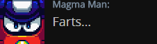

<h1>Mugshots</h1>

Usually, Mega Man Team epilogues have their dialog accompanied with a full sized sprite to enhance the scene. But in this team, every epilogue has its dialog accompanied by mugshots instead. Usually generic NPCs do not have mugshots so they are left with just text.

Since the dialog is done in script style format, it'll look very simplistic.

<h5>Example of what you've wrote:</h5>

Magma: Farts...
 

When the site loads the dialog, it will automatically format the characters name (like "Magma:") by replacing the text with a mugshot that is accompanied by the respective full character name and dialog.

<h5>Example of what the site converts your writing into:</h5>

  
<h1>How to Use Expressions</h1>

With Mugshots being used in epilogues, they are often done with variations of emotions to suit the current dialog. This is done to spice up the epilogue and prevent repetition (a problem that pleagued the team scene eps") and makes each scene stand out better.

The process to use expressions for a mugshot is actually very simple. Note how just typing "Magma" would only display the Neutral expression of the mugshot. To give him a different expression, you'd have to type the name of the expression right next to his name (no spaces) like Giddy.

<h5>Example of what you've wrote:</h5>

MagmaGiddy: Farts...
 

With the name of the expression being added right beside the character's name, it'll autmoatically use the variation of the mugshot based on the expression you've wrote.

<h5>Example of what the site converts your writing into:</h5>

<h5>(Note: The example shown is an expression exclusive to Magma Man)</h5>
  
<h1>Mugshot References</h1>

Below are tables showing each and every mugshot available for each character. 

<h2>Basic Expressions</h2>

Outside of rare instances, everyone has these type of basic expressions.
  

|          |Neutral| Happy |Annoyed| Angry |Shocked|  Sad  |Damaged|Relieved|
|-------|:---:|:---:|:---:|:---:|:---:|:---:|:---:|:---:|
| Magma    |Magma::|MagmaHappy::|MagmaAnnoyed::|MagmaAngry::|MagmaShocked::|MagmaSad::|MagmaDamaged::|MagmaRelieved::|
| Hornet   |Hornet::|N/A|HornetAnnoyed::|HornetAngry::|HornetShocked::|HornetSad::|HornetDamaged::|HornetRelieved::|
| Concrete |Concrete::|ConcreteHappy::|ConcreteAnnoyed::|ConcreteAngry::|ConcreteShocked::|ConcreteSad::|ConcreteDamaged::|ConcreteRelieved::|
| Plug     |Plug::|PlugHappy::|PlugAnnoyed::|PlugAngry::|PlugShocked::|PlugSad::|PlugDamaged::|PlugRelieved::|
| Galaxy   |Galaxy::|GalaxyHappy::|GalaxyAnnoyed::|GalaxyAngry::|GalaxyShocked::|GalaxySad::|GalaxyDamaged::|GalaxyRelieved::|
| Jewel    |Jewel::|JewelHappy::|JewelAnnoyed::|JewelAngry::|JewelShocked::|JewelSad::|JewelDamaged::|JewelRelieved::|
| Splash   |Splash::|SplashHappy::|SplashAnnoyed::|SplashAngry::|SplashShocked::|SplashSad::|SplashDamaged::|SplashRelieved::|
| Tornado  |Tornado::|TornadoHappy::|TornadoAnnoyed::|TornadoAngry::|TornadoShocked::|TornadoSad::|TornadoDamaged::|TornadoRelieved::|
| Fake     |Fake::|FakeHappy::|FakeAnnoyed::|FakeAngry::|FakeShocked::|FakeSad::|FakeDamaged::|FakeRelieved::|
| Spike*   |Spike::|SpikeHappy::|SpikeAnnoyed::|SpikeAngry::|SpikeShocked::|N/A|N/A|N/A|

<h5>*Name will display as Concrete instead of Spike.</h5>

<h2>Uncommon Expressions</h2>

Usually these are exclusive expressions to a character due to their unique personalities.
  

<h5>Magma Man</h5>

MagmaGiddy:: MagmaGiddy

 

<h5>Hornet Man</h5>

HornetGlare:: HornetGlare 
HornetPissed:: HornetPissed

<h5>Concrete Woman</h5>

N/A

<h5>Plug Man</h5>

PlugScared:: PlugScared 

<h5>Galaxy Man</h5>

GalaxyScared:: GalaxyScared  
GalaxyPissed:: GalaxyPissed  
GalaxyLenny:: GalaxyLenny  
GalaxyOwO:: GalaxyOwO  
GalaxySleep:: GalaxySleep

<h5>Splash Man</h5>

SplashNani:: SplashNani

  
<h5>Tornado Man</h5>

TornadoHotdog:: TornadoHotdog

  
<h5>Fakette</h5>

FakeSnicker:: FakeSnicker

  
<h5>Concrete Man</h5>

SpikeAloof:: SpikeAloof

